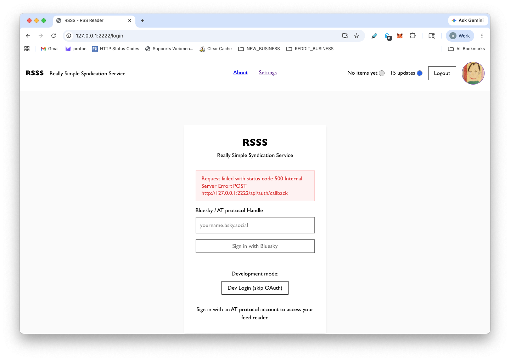

# RSSS

__Really Simple Syndication Service__

See [rsss.space](https://rsss.space/).

## Example Feeds

* [brittanyellich.com](https://brittanyellich.com/index.xml)
* [404media.co](https://www.404media.co/rss/)
* [interconnected.org](https://interconnected.org/home/feed)
* [piccalil.li](https://piccalil.li/feed.xml)
* [piccalil.li articles](https://piccalil.li/articles.xml)
* [piccalil.li the index](https://piccalil.li/the-index/feed.xml)
* [Wired Top Stories](https://www.wired.com/feed/rss)
* [Wired Gear](https://www.wired.com/feed/category/gear/latest/rss)
* [Wired Culture](https://www.wired.com/feed/category/culture/latest/rss)

>
> [!WARNING]  
> The Wired articles will be blocked by [privacy badger](https://privacybadger.org/#faq).
>

<details><summary><h2>Contents</h2></summary>

<!-- toc -->

- [Develop](#develop)
- [Architecture](#architecture)
  * [Local First](#local-first)
  * [Sync (remote/local)](#sync-remotelocal)
  * [Worker (Hono) - Main entry point](#worker-hono---main-entry-point)
  * [Durable Object per user (UserDO)](#durable-object-per-user-userdo)
  * [Frontend](#frontend)
- [Files](#files)
- [Running Locally](#running-locally)
- [Deploy](#deploy)
  * [Rotate `SESSION_SECRET`](#rotate-session_secret)
- [Notes](#notes)
  * [Generate a Secret](#generate-a-secret)
  * [Local Durable Object](#local-durable-object)
  * [Storage use vs quota](#storage-use-vs-quota)

<!-- tocstop -->

</details>


## Develop

```sh
npm start
```

## Architecture

### Local First

Local-first reads use a `SQLite` database (`@sqlite.org/sqlite-wasm`)
persisted to `OPFS` through SQLite's `OPFS-SAH-pool` VFS in a
cross-origin-isolated worker.

* `loadFeeds()`, `loadItems()`, `loadCounts()` read from the local
  SQLite DB through `localAdapter`.
* Works identically whether online or offline.
* Opt-in and gated on capability: requires the `syncSubscriptions`
  setting plus a cross-origin-isolated context with OPFS support.
  When either is missing, `getAdapter()` falls back to `remoteAdapter`,
  which calls the user's Durable Object directly.
* v1 is a single tab local-first mode. If another tab owns the OPFS
  SQLite handle, the second tab falls back to `remoteAdapter`.
* RSSS ships a web app manifest for installability, but v1 does not
  register a service worker or cache the app shell offline.

### Sync (remote/local)

- **Bootstrap** (`bootstrapLocalDb`) seeds the OPFS database on first
  use by paging through `/api/sync` and writing rows into SQLite.
- **Pull sync** (`pullSync`) hits `/api/sync?since=<lastSyncTime>` and
  upserts any new/updated feeds and items into the local SQLite DB.
- **Push sync** (`pushSync`) drains a local outbox of pending writes
  (read/star toggles, feed add/delete, etc.) back to the server.
- Outbox pushes include `client_op_id` and `client_updated_at`. v1 does
  not store a processed-op table on the server: add-feed retries use the
  unique feed URL as the idempotency key, delete-feed retries treat
  already-missing rows as success, and item updates plus mark-all-read
  are idempotent value assignments.
- Conflict responses use wrapped authoritative rows: feed conflicts
  return `{ feed }`, item conflicts return `{ item }`, and mark-all-read
  conflicts return `{ items }`.
- `State.sync()` triggers pull + push automatically on app startup
  (when authenticated + online) and when the browser fires the
  `online` event.


### Worker (Hono) - Main entry point

* Bluesky OAuth authentication (AT Protocol)
* Session management with encrypted cookies
* Route requests to user-specific Durable Objects
* Static asset serving for the Preact frontend


### Durable Object per user (UserDO)

* Uses SQLite storage for feeds and items
* Uses the Hibernation API (extends DurableObject)
* Alarms for periodic feed refreshing (every 10 minutes)
* Complete RSS/Atom feed parser

### Frontend

* Login page with Bluesky OAuth
* Feed management (add/delete/refresh)
* Item list with filtering (unread/starred/by feed)
* Item reader with read/star toggles
* Responsive design

---------------------------------------------------

## Images

### Blur-Up

We use the `@substrate-system/blur-hash` web component to do
[the blur-up technique](https://css-tricks.com/the-blur-up-technique-for-loading-background-images/).
The placeholder hash string is computed on the Cloudflare backend.


#### Computing the Hash String

The strings are computed by the Durable Objects whenever they get a new feed
item. The Durable Object resolves the `og:image` tag, then uses that image
to generate a blurhash string, and we save the blurhash string globally in
a KV cache.

1. When the DO ingests a new item and resolves its `og:image`, it calls
   `updateBlurhashFromCacheOrQueue` (`src/server/durable-objects/index.ts`).
2. That method hashes the image URL with SHA-256 (see
   `blurhashCacheKey` in `src/server/blurhash.ts`) and looks up the result
   in the `BLURHASH_KV` namespace (`expirationTtl` 90 days).
3. **Cache hit**: the cached `{ blurhash, image_width, image_height }`
   entry is written straight onto the `items` row and the DO's feed
   version is bumped.
4. **Cache miss**: the DO enqueues a `BlurhashJob` (image URL, item id,
   DO id) onto the `BLURHASH_QUEUE` Cloudflare Queue and continues
   serving the request — the rest of the work happens asynchronously.

The queue consumer is registered on the worker
(`worker.queue` in `src/server/index.ts`) and dynamically imports
`blurhash-runtime.ts` so the WASM image codec is only loaded in the
consumer isolate. For each job, `handleBlurhashQueueBatch`
(`src/server/blurhash-consumer.ts`):

* Re-checks `BLURHASH_KV` in case another item with the same image URL
  populated it concurrently.
* Fetches the image with a 10 s timeout, a 5 MiB ceiling, and a browser
  `user-agent` so origins that block bots still serve the og image.
* Decodes the bytes with `@cf-wasm/photon` (`PhotonImage.new_from_byteslice`),
  resizes to 32×32 with `SamplingFilter.Nearest`, and encodes the raw
  pixels with `blurhash`'s `encode()` using 4×4 components.
* Writes `{ blurhash, image_width, image_height }` into `BLURHASH_KV`
  with a 90 day TTL, then `POST`s it back to the originating DO at
  `/internal/blurhash/items/:id`, which updates the `items` row and
  bumps the feed version.

#### How the strings get into the page

The HTML served to the client is rendered server-side and cached per user
in `HTML_KV` under `html:v3:<did>:<version>`. Because the DO bumps its
`feed_version` whenever an item's blurhash is filled in, the next request
from that user misses the HTML cache and re-renders.

Rendering happens in `src/server/lazy-html.ts`:

* `injectInitialFeed` writes a `<script id="initial-feed" type="application/json">`
  block into `<head>`. That JSON payload is the same shape the client
  would otherwise fetch from `/api/sync`, and every item carries its
  `blurhash`, `image_width`, and `image_height` fields.
* `renderInitialFeedImage` replaces the `#root` placeholder with a fully
  hydrated item list. When an item has a valid blurhash plus dimensions,
  it emits `<blur-hash placeholder="..." src="..." width="..." height="...">`;
  otherwise it falls back to a plain ``. That is the markup
  `@substrate-system/blur-hash` upgrades when the component definition
  registers on the client.

This is a build-on-demand model: HTML is generated the first time a
signed-in user requests it after their feed version changes, then served
from `HTML_KV` until the next item (and therefore the next blurhash) lands.
Items that never get a blurhash (image fetch failed, 4xx, oversized, or
undecodable) are simply rendered as `` — the queue consumer `ack`s
the job and moves on, and the cache key is left empty so retries can
happen later.


---------------------------------------------------

## Files

```
src/
├── server/
│   ├── index.ts                    # Main Hono worker
│   ├── auth/                       # Bluesky OAuth implementation
│   └── durable-objects/
│       └── index.ts                # Per-user DO (UserDO) with SQLite
└── client/
    ├── index.ts                    # Main Preact entry
    ├── state.ts                    # State management & API client
    ├── style.css                   # All styles
    ├── db/                         # Local-first SQLite (OPFS) layer
    │   ├── sqlite-init.ts          # sqlite-wasm OPFS open/remove
    │   ├── sqlite-worker.ts        # OPFS-SAH-pool SQLite worker
    │   ├── local-adapter.ts        # Reads/writes against local DB
    │   ├── remote-adapter.ts       # Fallback: calls the DO directly
    │   ├── bootstrap.ts            # First-run seed of local DB
    │   ├── pull-sync.ts            # Server -> local
    │   └── push-sync.ts            # Local outbox -> server
    └── routes/
        ├── login.ts                # Login page component
        └── feed-reader.ts          # Main feed reader UI
```

## Running Locally

```sh
npm run start           # Start dev server
```

Then access `http://localhost:8888` and use the "Dev Login" button in
development mode.

---

## Deploy

1. Create a KV namespace for sessions:

```sh
wrangler kv namespace create SESSIONS
```

2. Add the returned namespace `id` to `wrangler.jsonc`.

   For local `wrangler dev`, also set the namespace `preview_id`. The
   Worker requires `compatibility_flags` to include `nodejs_compat`.

3. Configure the required environment variables:

| Name | Purpose |
| --- | --- |
| `APP_ORIGIN` | Canonical app origin (e.g. `https://rsss.space`). Required; CORS/CSRF allowlist fails closed when unset. |
| `ADMIN_TOKEN` | Bearer token for admin-only routes. |
| `SESSION_SECRET` | Secret used to encrypt session cookies. |
| `OAUTH_CLIENT_ID` | Bluesky OAuth client id. |
| `AUTUMN_SECRET_KEY` | Autumn billing API key. |
| `RESEND_API_KEY` | Resend API key for transactional email. |
| `RESEND_FROM` | Verified sender address for email. |

```sh
wrangler secret put ADMIN_TOKEN
wrangler secret put SESSION_SECRET
wrangler secret put OAUTH_CLIENT_ID
wrangler secret put AUTUMN_SECRET_KEY
wrangler secret put RESEND_API_KEY
wrangler secret put RESEND_FROM
```

Keep secret bindings out of `wrangler.jsonc` `vars`. In production,
`AUTUMN_SECRET_KEY` must be set with `wrangler secret put` or
`/api/health` returns a configuration error.

4. Deploy to staging:

```sh
npm run deploy:staging
```

5. Smoke test staging:

```sh
curl https://<your-domain>/api/health
curl https://<your-domain>/oauth/client-metadata.json
curl -i -X POST https://<your-domain>/api/auth/dev-login
curl -i -X POST https://<your-domain>/api/billing/checkout
```

6. Deploy to production:

```sh
npm run deploy:production
```

The production deploy script first checks that `env.production` in
`wrangler.jsonc` sets `NODE_ENV=production`. Production must return `404`
for `/api/auth/dev-login` and must not use the dev billing shortcut.

7. Smoke test production:

```sh
curl https://<your-domain>/api/health
curl https://<your-domain>/oauth/client-metadata.json
curl -i -X POST https://<your-domain>/api/auth/dev-login
curl -i -X POST https://<your-domain>/api/billing/checkout
```

### Rotate `SESSION_SECRET`

Generate a replacement secret, then run:

```sh
wrangler secret put SESSION_SECRET
npm run deploy:production
```

Rotating `SESSION_SECRET` invalidates active sessions because existing
session cookies can no longer be decrypted. Users need to sign in again.

---

## Notes

### Generate a Secret

```sh
openssl rand -base64 32
```

### Local Durable Object

```sh
sqlite3 \
  /Users/nick/code/rsss/.wrangler/state/v3/do/rsss-UserDO/\
5ccaac5db5efdc5e2ac84cd63b9141cf9dcf247c7a410cc13ce1f9d1ebbc1410.sqlite
```

### Storage use vs quota

```js
const { usage, quota } = await navigator.storage.estimate();
  
console.log(usage / (1024 * 1024).toFixed(2));
console.log(quota / (1024 * 1024).toFixed(2));
```

### Blur Hash

Using [blur-hash](https://github.com/substrate-system/blur-hash) for
the `og` images that come with blog posts.

At update time (when our server sees a new update in an RSS feed),
the server fetches all the `og`/`meta` tags in a blog post, and saves the
to URL to a global cache. So the URL is the key in the cache, and the value
is the blurhash string, which is generated by `@substrate-system/blur-hash`.

These blurhash strings are embedded in the static HTML file that we server to
clients, so the client is able to immediately render the blurhash placeholder.
When the blurhash strings are embedded in the HTML, we look at the feed
subscriptions for each user, and embed only the pages that are relevant to
that user's feed.

This does mean that we have to generate different HTML for each client. That is
a build-time task though, so we do that once for each client, then can serve the
same static file until we get a new `meta` image update (a new post in one of
their feeds).

This happens lazily too. We only generate a new HTML page at the time when a
request comes in for the given user, then we can serve the same HTML to that
user for repeated requests.




--------------------------------------------------------------

```
/ed3d-plan-and-execute:start-implementation-plan @DOCS/design-plans/2026-05-24-023-fix-initial-load.md .
```

--------------------------------------------------------------


 
