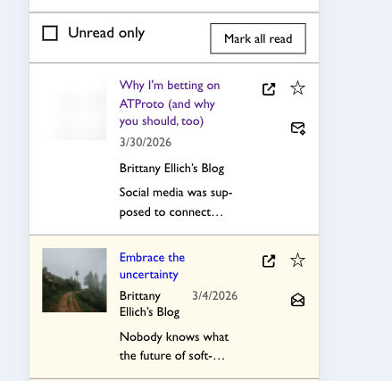
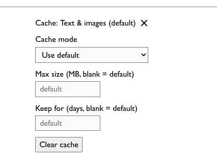
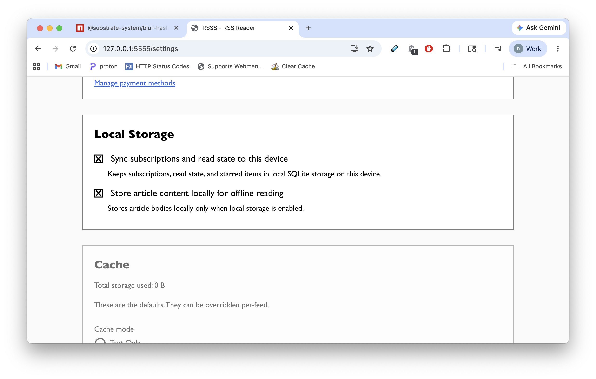
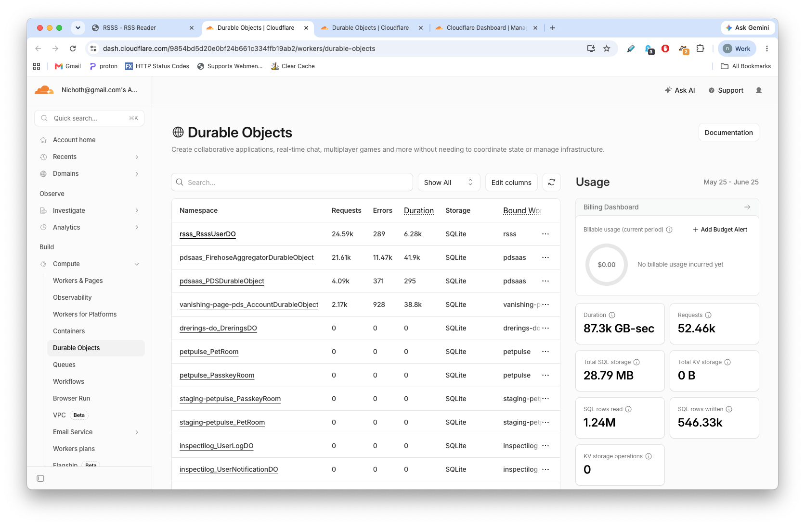

# TODO

* [x] The text excerpt below the date and author in each feed item should be
  full width, not constrained to the column. 
* [ ] Get rid of the "blank = default" text in the cache settings details.
  
  The input should just have the default set as its value, and if it is the
  default then the word "(default)" above the input -- ie "(MB, blank = default)"
  would be just "(default)".
* [ ] the "star" button -- when you click it, it is impossible to click it back
  the other way (can't "un-star" things) until you refresh the page.

## Cache Settings

* [ ] I enabled all the "Local Storage" options, but the cache settings below
  are still disabled .

---

## CF Usage

Why so many requests in `rsss_RsssUserDO`?

